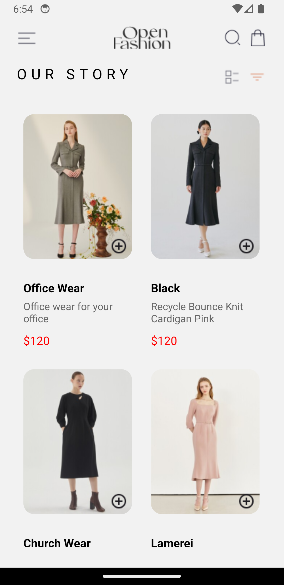

# Fashion App

**Fashion App** is a mobile application built with React Native and Expo, designed to showcase and manage a collection of outfits. Utilizing React Navigation's Stack Navigator, the app provides a smooth navigation experience, allowing users to explore different outfits, add items to their cart, and view their selections along with the estimated total price.

## Table of Contents

- [Features](#features)
  - [Home Screen](#home-screen)
  - [Cart Screen](#cart-screen)
- [Navigation](#navigation)
- [Alerts](#alerts)
- [Usage](#usage)
- [Screenshots](#screenshots)

## Features

### Home Screen

- **View Outfits**: Displays a list of available outfits with images, descriptions, and prices.
- **Add to Cart**: Each outfit has an "Add" button. Tapping this button adds the outfit to the cart and triggers an alert confirming the addition.

- **Navigate to Cart**: Users can navigate to the Cart Screen by tapping the shopping bag icon in the header.

### Cart Screen

- **View Cart Items**: Shows all the outfits added to the cart with details like title, description, and price.
- **Remove from Cart**: Each item has a remove button to delete it from the cart.
- **Estimated Total Price**: Displays the total price of all items in the cart at the bottom of the screen.

- **Navigation to Home Screen**: Users can navigate back to the Home Screen by tapping the menu button in the header.

## Navigation

The Fashion App uses React Navigation's Stack Navigator to manage transitions between the Home Screen and Cart Screen. This setup ensures smooth and intuitive navigation.

## Alerts

- **Add to Cart Alert**: When a user taps the "plus sign" button on any outfit in the Home Screen, an alert pops up confirming that the item has been added to the cart.

## Usage

1. **Viewing Outfits**: Start on the Home Screen to browse available outfits. Scroll through the list to see different items.
2. **Adding to Cart**: Tap the "Add" button next to any outfit to add it to your cart. An alert will confirm the addition.
3. **Viewing Cart**: Navigate to the Cart Screen to view all items added to the cart. The total price of the items will be displayed at the bottom.
4. **Navigating Back to Home**: Tap the menu icon in the top left corner of the Cart Screen to return to the Home Screen.

## Screenshots

